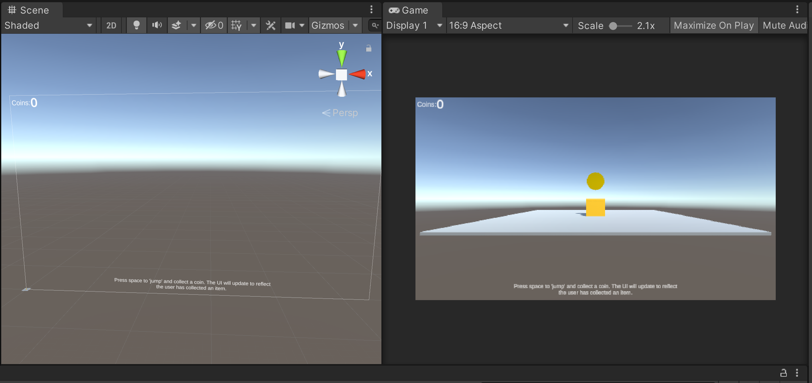
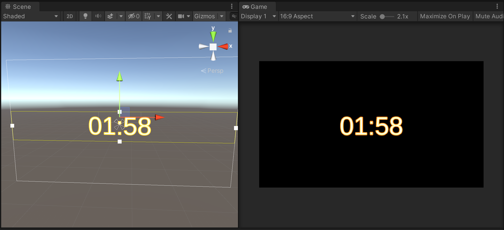
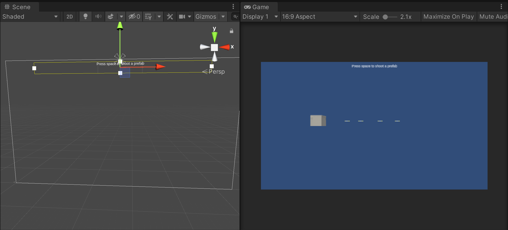
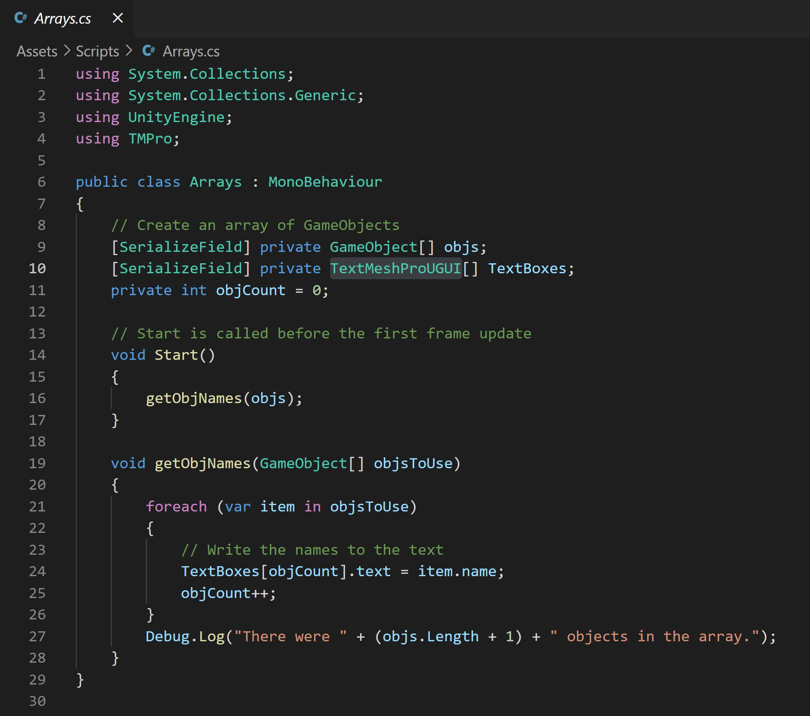

# UnityExampleCode
This is a collection of code that can be used for reference. Created in Unity 2020.2.6f1. I've tried to keep the scenes very simple and to the point in order not to confuse the topic at hand.

# ::Steps::
1. Clone repo
2. Open Unity Hub -> Add -> Navigate to <github>/UnityExampleCode/UnityExamples
3. Open any of the scenes and checkout the code.

# ::Examples::

Collect an object example - colleisions, text updating and user input.

A timer which will count down from the user set value while updating text. 

Spawning a prefab at runtime and adding velocity to it. Also has a timed Destroy script. 

Storing a collection of GameObjects in an array and learing how to cycle through them - in this case, displaying their names. 
